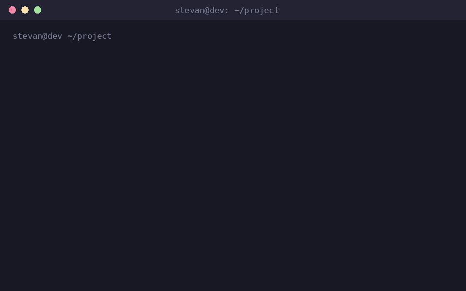

# Ask Colleague

[](https://www.npmjs.com/package/ask-colleague)

A tiny, dependency-free bridge that lets one local AI coding CLI ask another for a one-shot second opinion:

- Claude Code asks Codex with `colleague ask codex ...`
- Codex asks Claude Code with `colleague ask claude ...`

Both CLIs have headless one-shot modes (`codex exec -` and `claude -p`), so "ask a colleague" is just a local shell bridge: the primary agent writes a compact context briefing, invokes the peer once, treats the answer as advice rather than ground truth, and continues in the original session.



## Quick start

```bash
npx ask-colleague@latest install
```

Then trigger it with:

- `/colleague` in Claude Code
- `$colleague` in Codex

## Install

The installer places these files:

```text
~/.local/bin/colleague
~/.local/bin/ask-colleague
~/.claude/skills/colleague/SKILL.md
~/.agents/skills/colleague/SKILL.md
~/.agents/skills/colleague/agents/openai.yaml
~/.codex/prompts/colleague.md          # legacy Codex custom prompt fallback
~/.ask-colleague/install-manifest.tsv
```

Make sure `~/.local/bin` is in your `PATH`, then check your setup:

```bash
export PATH="$HOME/.local/bin:$PATH"
colleague doctor
```

The installer refuses to overwrite existing files unless they are tracked in the install manifest and unmodified. Use `--force` only when you intentionally want to replace an existing install. To install only selected parts, pass `--bin`, `--claude`, `--codex`, or `--prefix DIR`.

Installing from source does the same thing:

```bash
git clone https://github.com/stevyhacker/ask-colleague.git
cd ask-colleague
./install.sh
```

### Optional global Codex fallback

Install does **not** modify `~/.codex/AGENTS.md` by default, because that file affects every Codex session. To opt into the fallback block for Codex versions that do not load skills or prompts as expected:

```bash
npx ask-colleague@latest install --agents-md
```

The block is marker-delimited and idempotent. You can also copy `snippets/AGENTS.md` into a project-level `AGENTS.md` to scope the fallback to specific repos.

### Uninstall

```bash
colleague uninstall
# or, without the installed command:
npx ask-colleague@latest uninstall
```

Uninstall removes only files recorded in the install manifest whose checksums still match. If you edited an installed skill or prompt, uninstall leaves it in place; pass `--force` if you really want it removed.

### Windows

`colleague` is a Bash CLI. On Windows, run everything — `npx`, the install, and the `claude`/`codex` CLIs — inside WSL (recommended) or Git Bash (best effort). Running the install from PowerShell or cmd.exe prints setup guidance instead of failing on a missing Bash.

## Usage

### Direct CLI

```bash
# Create and edit a briefing
ctx="$(mktemp -t colleague-ctx.XXXXXX.md)"
colleague make-context --output "$ctx"
$EDITOR "$ctx"

# Ask a peer
colleague ask codex --context "$ctx" --question "What is the strongest critique of this plan?"
colleague ask claude --context "$ctx" --question "What bug am I most likely missing?"

# Preview the assembled prompt without calling either CLI
colleague ask codex --context "$ctx" --question "Review this" --dry-run
```

With `COLLEAGUE_DEFAULT_PEER` set, you can omit the peer name:

```bash
export COLLEAGUE_DEFAULT_PEER=codex
colleague ask --context "$ctx" --question "Review this plan"
```

### From Claude Code

```text
/colleague ask Codex to critique my current plan
```

The skill is explicit-only (`disable-model-invocation: true`). It instructs Claude to write a concise briefing to a private `mktemp` file, run `colleague ask codex ...`, compare the response with its own analysis, and proceed using its own judgment.

### From Codex

The skill (`~/.agents/skills/colleague`) is the preferred path and is also explicit-only (`allow_implicit_invocation: false`):

```text
$colleague ask Claude to critique my current plan
```

The legacy custom prompt fallback also works:

```text
/prompts:colleague is optimistic locking the right call for this endpoint?
```

## Options

```text
colleague ask [codex|claude] --context FILE --question TEXT [options]

--cwd DIR             run the peer CLI from this directory
--model MODEL         pass a model override to the peer CLI
--sandbox MODE        Codex sandbox: read-only, workspace-write, danger-full-access
--timeout SECONDS     use timeout/gtimeout when available
--max-bytes BYTES     refuse over-large context files
--allow-large-context disable the size guard
--dry-run             print the prompt, do not call peer CLI
```

Environment defaults:

```bash
export COLLEAGUE_DEFAULT_PEER="codex"
export COLLEAGUE_CODEX_MODEL="gpt-5.4"
export COLLEAGUE_CLAUDE_MODEL="sonnet"
export COLLEAGUE_CODEX_SANDBOX="read-only"
export COLLEAGUE_TIMEOUT="120"
export COLLEAGUE_VERBOSE="1"
export COLLEAGUE_MAX_CONTEXT_BYTES="120000"
export COLLEAGUE_STATE_DIR="$HOME/.ask-colleague"
```

## Safety model

The consultation is intentionally one-shot and read-oriented:

- Do not paste raw transcripts or include secrets, `.env` contents, keys, or tokens in the briefing.
- The prompt is sent through stdin to avoid shell quoting and argument-length problems.
- Codex runs via non-interactive `codex exec` with `--sandbox read-only` by default.
- Claude runs with `-p --output-format text --no-session-persistence --max-turns 1 --tools ""`.
- Installed skills are explicit-only by default, so paid/authenticated CLIs are never called by surprise.
- The peer response is advice only; the primary agent remains responsible for verifying and deciding.

See `docs/security.md` for details.

## Good context beats big context

A good briefing is usually under 1,000–2,000 words:

```markdown
# Goal

# Relevant files and snippets

# What I tried

# Current error or dilemma

# Constraints / non-goals
```

Avoid full transcripts, tool logs, whole pasted files, and vague questions like "thoughts?". Ask pointed questions instead: "What edge case does this migration plan miss?", "Is there a simpler patch than adding a new abstraction?", "What would you reject in review?"

## Troubleshooting

**`WSL ... execvpe(/bin/bash) failed` on Windows** — version 0.1.0 pointed the npm bin directly at the Bash script, so PowerShell invoked the WSL bash stub. Upgrade with `npx ask-colleague@latest install`, then run the bridge inside WSL or Git Bash.

**`colleague: codex/claude CLI not found in PATH`** — install the missing CLI and confirm `codex --version` or `claude --version` works in the same shell.

**Install refuses to overwrite a file** — the file exists and is not tracked as an unmodified install. Inspect it first; re-run with `--force` only if it should be replaced.

**Uninstall leaves a file in place** — the file was modified after install. Keep it, remove it manually, or run `colleague uninstall --force`.

**The agent does not use the skill** — invoke it explicitly (`/colleague ...` in Claude Code, `$colleague ...` in Codex). The skills are intentionally explicit-only.

**The peer answer is generic** — the briefing is too thin. Add file paths, the exact error, constraints, and a pointed question.

**The peer answer is distracted** — the briefing is too large. Remove transcript/tool noise and keep only the current decision point.

## Development

```bash
npm test
```

The smoke tests use dry-run and mocked CLI paths, so they do not require authenticated Codex or Claude CLIs. The package has no runtime npm dependencies; Node/npm are only the distribution mechanism (`bin/colleague.js` is a small launcher that finds a real Bash, which keeps the npm bin working on Windows).

See `docs/publishing.md` for the release checklist.

## License

MIT. See `LICENSE`.

## References

- Codex CLI docs: https://developers.openai.com/codex/cli/reference
- Codex skills docs: https://developers.openai.com/codex/skills
- Claude Code CLI docs: https://docs.anthropic.com/en/docs/claude-code/cli-reference
- Claude Code skills docs: https://docs.anthropic.com/en/docs/claude-code/skills
